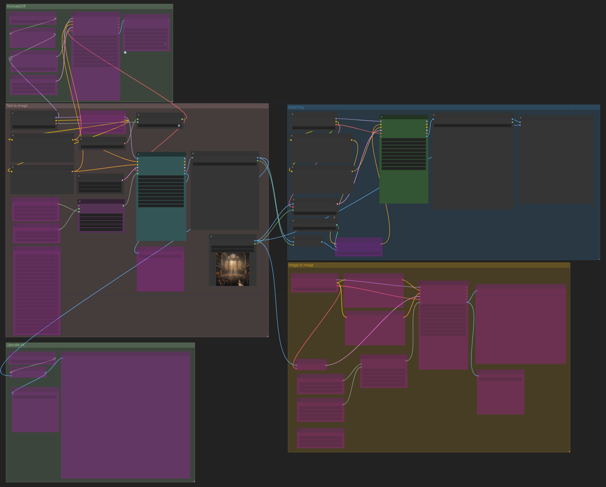

# ComfyUI workflow (workflow.json)

My multifunctional ComfyUI workflow for working with Stable Diffusion models.

Features:
* Text-to-image (custom VAE toggle on/off, XY plot of different samplers, CFG scales, steps)
* Image-to-image (using the text-to-image or a custom input)
* Inpainting (with optional inpainting ControlNet)
* Basic 4x upscaling (of any of the above output images)
* AnimateDiff (generating .gif or video files from prompts)

Different features are in their own groups and can be toggled on/off (bypassed) manually

Works with all models in theory. Tested and works with:
* FluentlyXL-Final / FluentlyXL-Final-VAE
* Sampler: dpmpp_2m
* Scheduler: karras
* Denoise: 1.0
* CFG: 8.0
* Steps: 20

# Zoomed out overview of the workflow

